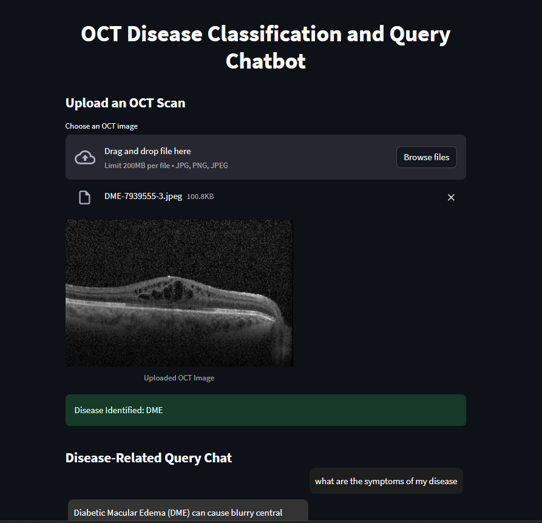
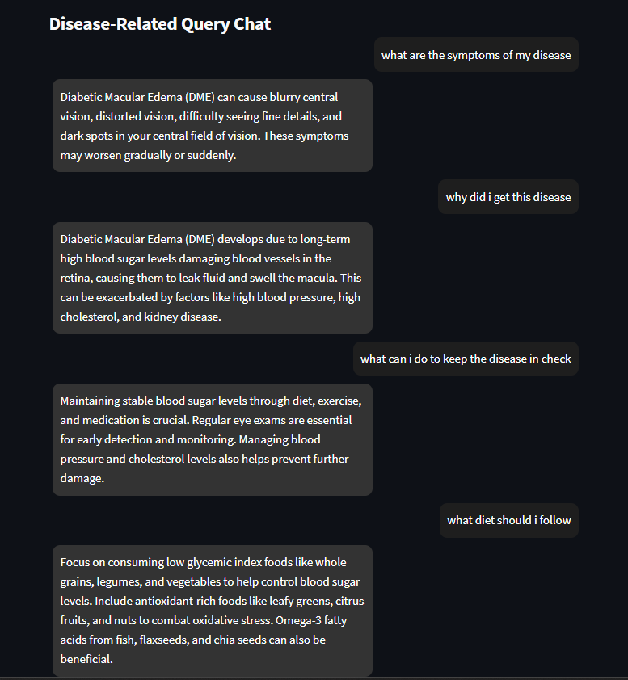

## Abstract
 This project presents an AI-driven system for the classification of retinal diseases using Optical Coherence Tomography (OCT) images and a chatbot that answers disease-related queries. The project utilizes Convolutional Neural Networks (CNNs) and Vision Transformers (ViT) for image classification and Retrieval-Augmented Generation (RAG) for real-time information retrieval in the chatbot. 

 Our Project has 2 parts
 - Classification of the patient's condition using a classifier(EfficeientNet, DenseNet,ViT,Swin Transformer)
 - Answering the user's condition related queries using RAG and Prompt Engineering

## Model codes
This folder contains all the codes used to train the models. The models which we used for the classification are
- EfficientNet
- DenseNet
- Vision Transformer(ViT)
- Swin Transformer(Swin)

There is python notebook named comparisions.ipynb in which u can see we ran all the models on the test dataset and got their test accuracy, Weighted Precision, Weighted Recall and Weighted F1 Score. Based on the performance EfficientNet has been taken as the final model for classification

If u want to replicate the results please run the python notebook in google colab by changing the dataset paths. If u just want see our working code follow the instructions in Usage section

### Models
This folder contains all the model pytorch files(pth)

### Sample OCT scans
This folder contains some samples of OCT scans of each class

## Usage
- Open this folder in vscode
- first install all the requirements using the `pip install -r requirements.txt` 
- run the app.py file using `streamlit run app.py`
- open the browser, Our app will be running on http://localhost:8501/
- U can upload an oct scan from the given Sample OCT scans folder
- The model first classifies the condition
- Further User can ask his condition related queries in the query text box given and get the answer from the chatbot using RAG and prompt engineering

We have provided 2 Gemini api keys in the app.py file. 
If u get resources exhausted comment out the current one and use the other one. 

 Google drive link of our project folder is - https://drive.google.com/drive/folders/1sVIluFW411GlnT2y9VprnSaAOFgxkpPD?usp=sharing
This folder contains the dataset, mini dataset, model codes

Here mini.py has been used to create a mini dataset(10% of the original dataset)
exp.ipynb contains the rough work done while making the app.py file

Below are some screenshots of our work

